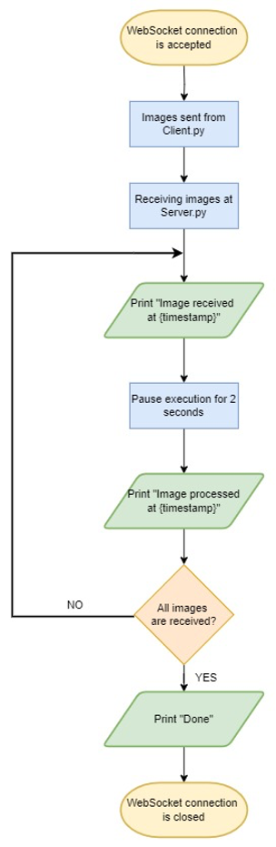
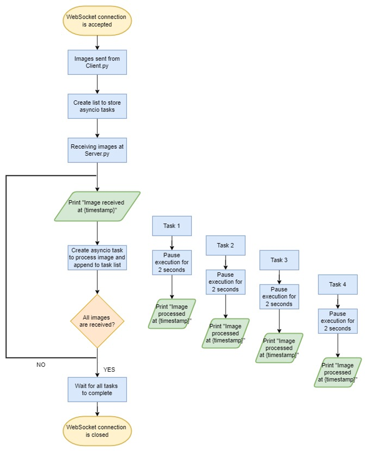

# Parallel Image Processing with WebSockets

This project demonstrates how to send and process multiple images between a **client** and a **server** using **WebSockets**. It highlights the difference between **sequential execution** and **parallel execution** using Python’s `asyncio`.

---
## 🔁 Sequential Workflow


---

## 🔀 Parallel Workflow


---

## 📌 Features

- **Client (`client.py`)**
  - Reads images from a folder and sends them to the server.
  - Supports sending multiple images in sequence or parallel.

- **Server (`server.py`)**
  - Accepts WebSocket connections from clients.
  - Receives and processes images.
  - Implements **sequential** and **parallel (`asyncio`)** processing modes.
  - Logs timestamps of image reception and processing for performance analysis.

- **Performance Comparison**
  - Sequential mode → images processed one after another (longer total time).
  - Parallel mode (`asyncio`) → images processed concurrently (faster overall).

---

## 🛠️ Installation

1. Clone this repository:

   ```bash
   git clone https://github.com/your-username/parallel-websocket.git
   cd parallel-websocket
   ```

2. Create a virtual environment:

   ```bash
   # Windows
   python -m venv venv
   venv\Scripts\activate

   # macOS / Linux
   python3 -m venv venv
   source venv/bin/activate
   ```

3. Install dependencies:

   ```bash
   pip install -r requirements.txt
   ```

---

## 🚀 Usage

### Start the Server

```bash
python server.py
```

### Run the Client

```bash
python client.py
```

- Place your test images in the `./images` folder.  
- The client will read and send them to the server.  
- Server logs will show whether images are processed **sequentially** or **in parallel**.

---

## 📊 Example Logs

### Sequential Execution

```
Client Read: image1.jpg Sent: image1.jpg
Client Read: image2.jpg ...
Server Image received at 14:12:33
Image processed at 14:12:35
Image received at 14:12:37
Image processed at 14:12:39
```

➡️ Images are processed **one by one**, causing delays.

---

### Parallel Execution (asyncio)

```
Client Read: image1.jpg Sent: image1.jpg
Client Read: image2.jpg ...
Server Image received at 09:20:24
Image processed at 09:20:26
Image processed at 09:20:26
Image processed at 09:20:26
```

➡️ Images are processed **concurrently**, reducing total time.

## 📖 References

- [Python asyncio](https://docs.python.org/3/library/asyncio.html)  
- [WebSockets API (MDN)](https://developer.mozilla.org/en-US/docs/Web/API/WebSockets_API)  
